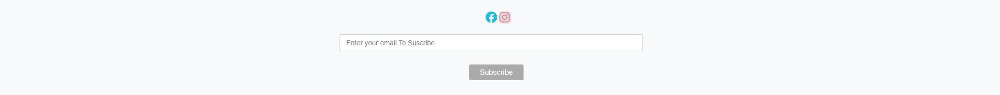

# Treats Sweet Shop
Treat Sweet Shop is a e-Commerce website that I build Using the Django Full Stack Frameworl for my fifth and final project at Code Institute.
Treats Sweet shop is a online sweet store where users can purchase sweets from a wide variety, there is alos a secion on the website that allows users to leave review of their experience shoppping at Treats. I have also include a blog section where that admin can post blog and then registered users are able to comment underneath said blogs.
  
  

[Click Here To Visit Live Site](https://treats-sweet-shop.herokuapp.com/)  

## Table Of Contents:
1. [UX Design](#ux-design)
    * [User Stories](#user-stories)
    * [Wireframes](#wireframes)
    * [Agile Methodology](#agile-methodology)
    * [Typography](#typography)
    * [Colour Scheme](#colour-scheme)
    * [Database Diagram](#database-diagram)

3. [Marketing](#marketing)

2. [Features](#features)
    * [Navigation](#Navigation-bar)
    * [footer](#footer)
    * [Home Page](#home-page)
    * [Recipes Page](#recipes-page)
    * [Recipe Details](#recipe-details)
    * [Add Recipe Page](#add-recipe-page)
    * [Edit Recipe Page](#edit-recipe-page)
    * [Delete Recipe Page](#delete-recipe)
    * [Edit Comment Page](#edit-comment-page)
    * [Wines](#wines-page)
    * [Wine Detail Page](#wine-details-page)
    * [Add Wine Page](#add-wine-page)
    * [Edit Wine Page](#edit-wine-page)
    * [Delete Wine](#delete-wine)
    * [Register Page](#register-page)
    * [Login Page](#login-page)
    * [Logout Page](#logout-page)

3. [Future Features](#future-features)
4. [Technologies Used](#technologies-used)
5. [Testing](#testing)
6. [Deployment](#deployment)
7. [Credits](#credits)
8. [Acknowledgements](#acknowledgements)

### User Stories
Below are the user stories that were added to the Github project, They can be found [here](https://github.com/kpsdev1/Treats-Sweet-Shop/issues) in the issue section of the repository.

**EPIC | Navigation**
- As a User I can easily navigate around the site so that I can view different pages and sections on the site.

**EPIC - Registration & Login / Logout**
- As a User I can Sign-in/ Sign-out so that I can access features when signed in and sign-out so that no one can access my account.
- As a User I can Register an account so that I can use the full functionality of the site.
- As a User I can register with my social media account so that I can sign up faster.

**EPIC - CRUD Functionality**
- As a User I can view a list of products so that click on one to see the product details.
- As a Superuser I can add a new product so that I can sell them on the site.
- As a Superuser I can edit a product so that I can make changes to a product.
- As a Superuser I can delete a product from the site.
- As a User I can add a product to my shopping cart so that I can purchase it.
- As a User I can Update my shopping cart so that I can change what's in my cart before checking out.
- As a User I can remove a product from my cart so that can remove it an purchase the other items in my cart.
- As a User I can Leave a review so that share my experience of shopping here.
- As a User I can edit my review so that I can I can change it.
- As a User I can Delete my review so that I can remove it.

### Wireframes
Below are the wireframes for the site that I created using balsamiq.

### Agile Methodology
Github projects was used to track the development of this website using the agile approach, the project can be found [here](https://github.com/users/kpsdev1/projects/6).

### Typography
- The font that was used for the logo was **Ysabeau**.
- **Montserrat** font was used for the body.

### Colour Scheme
For this site I decide to keep the main color scheme very simple, with the text being black or grey. The logo and the login/ logout page headings in green. I did also have some buttons like the delete, cancel, edit and post buttons red, orange and blue but the main color scheme of the site was black, white, grey.
  
  

### DataBase Diagram
Below is the database diagram that I created using LucidCharts.

  
- - -

## Features

### Navigation Bar
- The Navigation bar sits at the very top of each page, The logo is at the right hand side and the navigation links are then to the left of the center of the page with the search, card and login/ register to the right hand side.
- When logged in the links for **Login** and the **Registeration** change to **My Profile** and logout, if the user is a superuser then they will also have a **Add Product** link.
- The Navbar background is a light grey which is colored using the the bootstrap **bg-info** class, the logo is green and the links are black in colour.
- The active page (page that the user is currently on) is displayed in bold text, this makes it stand out much more and is clear to the user which page they are on.
- When on medium to small screens the navigation menu changes to burger menu which shows all the nav links when clicked on.

  

### Footer
- The footer is found at the bottom of every page and responsive for tablet and mobile too.
- There are icon links to the business Instagram and Facebook page(please note these may have been removed byy facebook when you are reading this as they tend to remove fake pages).
- Beneath this is an input box where the user enter their email address, which will allow them to suscribe to the shops newsletter
- The background is also light grey like the Navigation bar.

- - -

### Home Page
- The home page has 2 large images that both take up 50% of the screen width on large devices and 100% on small and medium screens.
- The image on the left is a image that i created using illustrator that syas **Treat Yourself** and then underneather the text there nis a button that says **Shop Now**, which once clicked will bring users to the all products page.
- The image on the right is a picture of different sweets on a table.

 
- - -  

### Products Page
- At the top of the Products page, right below the Nav bar there is a H1 heading that says **Products** which is underlined and centered.
- Below this are the Product cards which are displayed in the bootstrap card format, they are displayed 4 across on x-large screens, 3 cross on large screens, 2 on small and medium and 1 accross on x-small screens which makes the page fully resonsive to all devices.
- On the right hand side above the products is a sort filter, where the user can sort by price, low to high or high to low and also can search alphabetically from A-Z or from Z-A.
- Each product displays a picture of the product, the name of it, the price and the category it is in, if the user clicks on the picture it will bring them to the product detail page where they can purchase a product.

 
- - -

### Product Details Page
- On the products detail you will see the product image on the left and on mobile and small devices this will be the full width bar some padding.
- On the right of this you will have the product name, the price, a description, the category and if the user is an admin you will also see a delete and edit button. 
- Then you will see a quantity selector that can be increased or decrease by the **+** or **-** signs. Below the quantity sign there is a back button that will bring you **Back** to products when clicked and there is also an **Add to cart** button that will add the product to your cart so you can purchase.

 
- - -

### Shopping Cart Page
- When a user adds a product to thir cart it is deisplayed in the shopping cart page, the user can add multiple products to their cart
- At the top you will see a H2 heading saying **shopping cart** with a horizontial line above and below it.
- Then you will see 4 table headings which will say **Product Info**, **Price**, **Qty**, **Subtotal**.
- In the **Product Info** column you will see a small picture of the product and the product name, in the **Price** colument you will see the price for each product. In the **Qty** you will see the quantity which you can change with the selector and click update, There is also a button to remove a product here. Then in the **Subtotal** column you will see the subtotal price for each item.
- Below the products that are in the shopping cartt towards the right you will see the **Cart Total** and below this the **Delivery** which when added together will give you the **Grand Total**, beneath the grand total in red it will tell you how much more you need to spend to get free deleivery if you havent already surpased it.
- The we have a **back** button which will bring the user back to the **Products** page and a **Secure Checkout** button which will bring the user to the secure checkout.

 
- - -

## Future Features

## Technologies Used
- [Balsamiq](https://en.wikipedia.org/wiki/Balsamiq) was used to create the wireframes.
- [LucidChart](https://www.lucidchart.com/pages/) was used to design the database schema.
- [HTML](https://en.wikipedia.org/wiki/HTML) was used for the mark up.
- [CSS](https://en.wikipedia.org/wiki/CSS)  was used to style the site.
- [Django](https://www.djangoproject.com/) was the framework that was used.
- [Python](https://en.wikipedia.org/wiki/Python_(programming_language)), django is a python framework.
- [Bootstrap](https://en.wikipedia.org/wiki/Bootstrap_(front-end_framework)) was also used to style the site.
- [JavaScript](https://en.wikipedia.org/wiki/JavaScript) was used for interactiveness.
- [Gitpod](https://www.gitpod.io/about) was used to create this site and then push everything to github.
- [Heroku](https://en.wikipedia.org/wiki/Heroku) is used to host this site.
- [Github](https://en.wikipedia.org/wiki/GitHub) was used to store the code.
- [Git](https://en.wikipedia.org/wiki/Git) was used for version control.
- [AWS](https://aws.amazon.com/) was used to store the images and static files.
- [ElephantSQL](https://www.elephantsql.com/) was used to store the database.
- - -

## Testing

## Deployment
This website is deployed to Heroku from a github repository, the following steps were taken:

#### Creating Respository on Github
- First make sure you are signed into [Github](https://github.com/) and go to code institutes template, which can be found [here](https://github.com/Code-Institute-Org/gitpod-full-template).
- Then click on **use this template** and select **Create a new repository** from the drop down. Enter the name for the repository and click **Create repository from template**.
- Once the repository was created, I clicked the green **gitpod** button to create a workspace in gitpod so that I could write the code for the site.

#### Creating app on Heroku
- After creating the repository on github, head over to [heroku](https://www.heroku.com/) and sign in.
- On the home page, click **New** and **Create new app** from the drop down.
- Give the app a name(this must be unique) and select a **region** I chose **Europe** as I am in Europe, Then click **Create app**.

#### Create a database On ElephantSQL
- Log into the [ElephantSQL](https://www.elephantsql.com/) website and click **Create new Instance**
- Enter a **Name** and keep the plan as **Tiny Turtle Free**, then **tags** field can be left blank, Select a region closest to you, I selected **EU-West-1(Ireland)** as I'm in Ireland. Then click **Review** and afterwards click **create instance**.
- On The Dashboard click on your database instance name.
- You will see the details for your database instance, in the url section click on the copy icon to copy the database url.
- Head over to gitpod and create a **Database URL** enviroment variable in your env.py file and set it equal to the copied url.

#### Deploying to Heroku.
- Head back over to [heroku](https://www.heroku.com/) and click on your **app** and then go to the **Settings tab**
- On the **settings page** scroll down to the **config vars** and enter your key and value pairs.
- Then scroll to the top and go to the **deploy tab** and go down to the **Deployment method** section and select **Github** and then sign into your account.
- Below that in the **search for a repository to connect to** search box enter the name of your repository that you created on **github** and click **connect**
- Once it has connected scroll down to the **Manual Deploy** and click **Deploy branch** when it has deployed you will see a **view app** button below and this will bring you to your newly deployed app.
- Please note that when deploying manually you will have to deploy after each change you make to your repository.
- - -

## Credits

## Acknowledgements