# Treats Sweet Shop
Treats Sweet Shop is a e-commerce website that I build using the Django Full Stack Framework for my fifth and final project in Full Stack Development at Code Institute.
Treats Sweet Shop is a online sweet store where users can purchase sweets from a wide variety of products, there is also a section on the website that allows users to leave reviews of their experience shopping at Treats. I have also included a blog section where the admin can post a blog and then registered users are able to comment underneath said blogs.
  
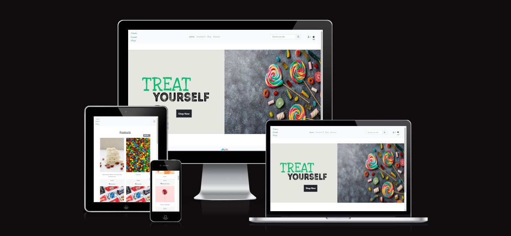  

[Click Here To Visit Live Site](https://treats-sweet-shop.herokuapp.com/)

## Table Of Contents:
1. [UX Design](#ux-design)
    * [User Stories](#user-stories)
    * [Wireframes](#wireframes)
    * [Agile Methodology](#agile-methodology)
    * [Typography](#typography)
    * [Colour Scheme](#colour-scheme)
    * [Database Diagram](#database-diagram)

2. [Marketing](#marketing)

3. [Features](#features)
    * [Navigation](#Navigation-bar)
    * [footer](#footer)
    * [Home Page](#home-page)
    * [Products Page](#products-page)
    * [Product Detail Page](#product-detail-page)
    * [Shopping Cart Page](#shopping-cart-page)
    * [Checkout Page](#checkout-page)
    * [Blog Page](#blog-page)
    * [Blog Detail Page](#blog-detail-page)
    * [Reviews Page](#reviews-page)
    * [Add Review Page](#add-review-page)
    * [Edit Review Page](#Edit-review-page)
    * [Add Product Page](#add-product-page)

4. [Future Features](#future-features)
5. [Technologies Used](#technologies-used)
6. [Testing](#testing)
7. [Deployment](#deployment)
8. [Credits](#credits)
9. [Acknowledgements](#acknowledgements)

## UX Design

### Site Goals
- To provide the site owner with a website to sell their products.
- To provide users with a good shopping experience.
- To provide users with a site that is easy to navigate and understand.
- To provide a safe a reliable site where users can purchase sweets.
- To provide a site that allows users to purchase products without having to register, which makes for a easy and fast shopping experience.

### User Stories
Below are the user stories that were added to the Github project, They can be found [here](https://github.com/kpsdev1/Treats-Sweet-Shop/issues) in the issue section of the repository.

**EPIC | Navigation**
- As a User I can easily navigate around the site so that I can view different pages and sections on the site.
- As a User I can Search the site for a product so that I can find what I'm looking for.

**EPIC - Registration & Login / Logout**
- As a User I can Sign-in/ Sign-out so that I can access features when signed in and sign-out so that no one can access my account.
- As a User I can Register an account so that I can use the full functionality of the site.
- As a User I can register with my social media account so that I can sign up faster.
- As a User I can reset my password so that I can change it if I have forgotten it or want to change it.

**EPIC - CRUD Functionality**
- As a User I can view a list of products so that I can click on one to see the product details.
- As a Superuser I can add a new product so that I can sell them on the site.
- As a Superuser I can edit a product so that I can make changes to a product.
- As a Superuser I can delete a product from the site.
- As a User I can add a product to my shopping cart so that I can purchase it.
- As a User I can Update my shopping cart so that I can change what's in my cart before checking out.
- As a User I can remove a product from my cart so that I can remove it and purchase the other items in my cart.
- As a User I can leave a review so that I can share my experience of shopping here.
- As a User I can edit my review so that I can change it.
- As a User I can Delete my review so that I can remove it.

**EPIC - Administration**
- As a Site Admin I can administer the site so that I can manage the sites content.
- As a Site Owner I can Publish Blog posts so that customers can read them.
- As a Site owner I can make changes to blog posts so that I have full control over them.
- As a Admin I can have a email newsletter signup so that I can collect emails to send information about upcoming deals.
- As a Admin I would like to send an order confirmation when a product is purchased so that the user knows that the order went through.
- As a Admin I want a verification email sent so that so that the user has to verify their account.

### Wireframes
Below are the wireframes for the site that I created using balsamiq.
Please note the finished product differed a bit from the wireframes.

    
Home Page
  

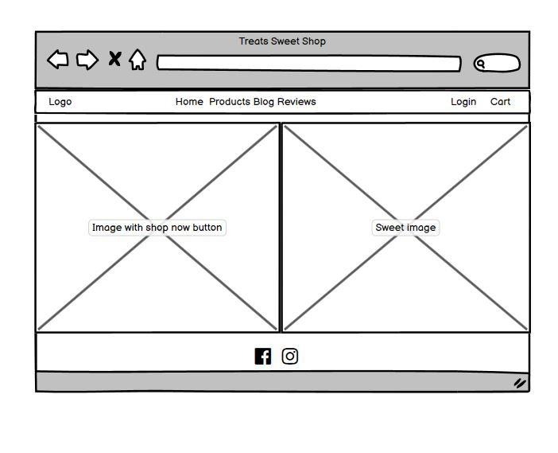  

    
Products Page
  

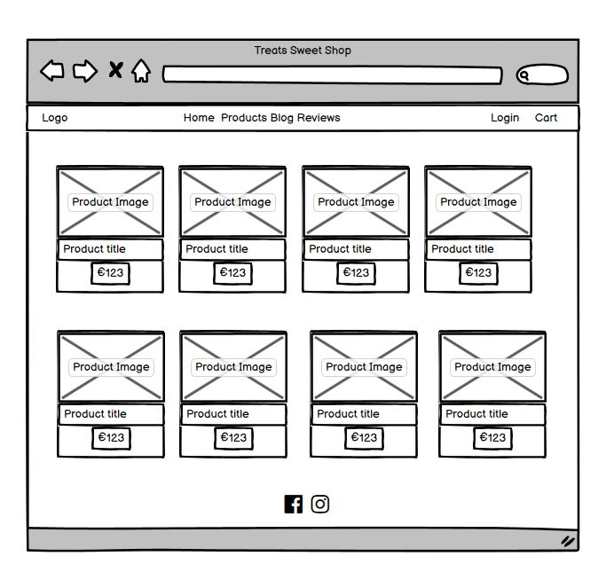  

    
Blog Page
  

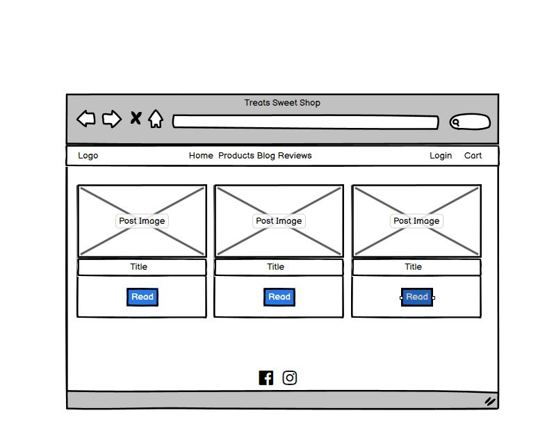  

    
Blog Details Page
  

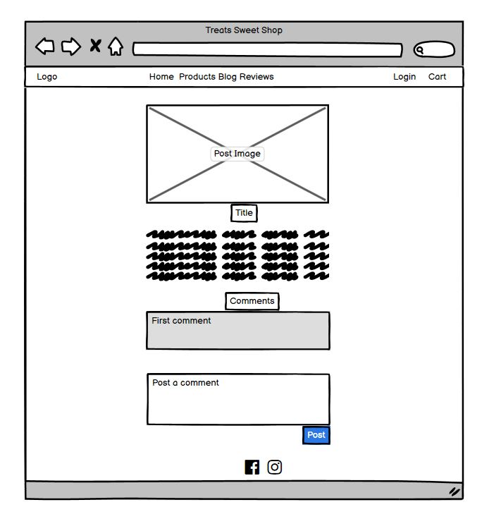  

    
Reviews Page
  

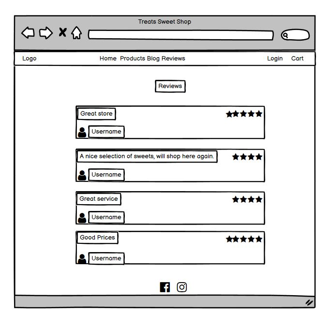  

    
Login Page
  

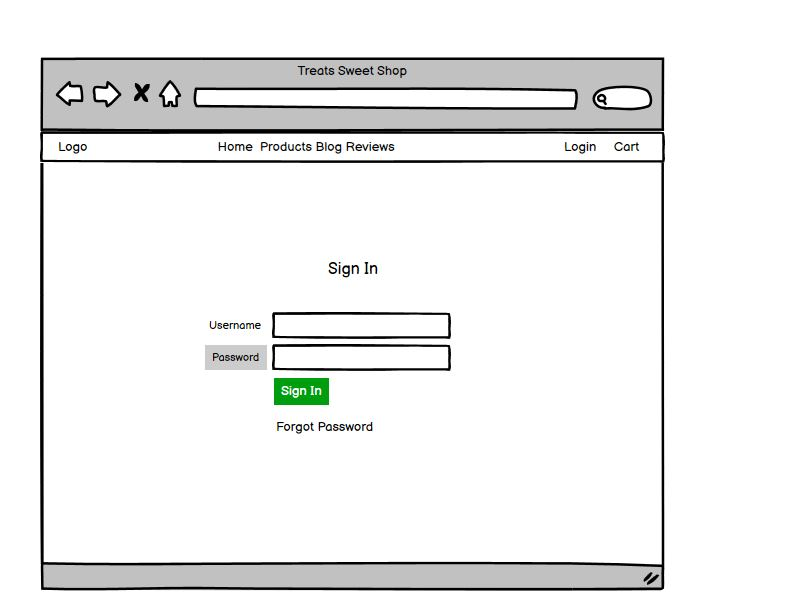  

    
Register Page
  

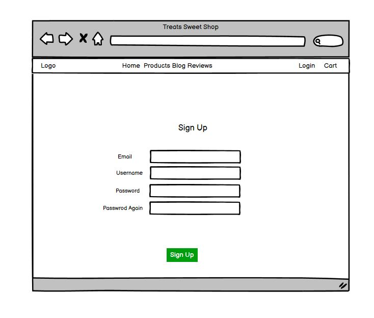  

### Agile Methodology
Github projects was used to track the development of this website using the agile approach, the project can be found [here](https://github.com/users/kpsdev1/projects/6).

### Typography
- The font that was used for the logo was **Ysabeau**.
- **Montserrat** font was used for the body.

### Colour Scheme
For this site I decide to keep the main color scheme very simple, with the text being black or grey. The logo and the login/ logout page headings in green. I did also have some buttons like the delete, cancel, edit and post buttons red, orange and blue but the main color scheme of the site was black, white, grey and green.
  
  

### DataBase Diagram
Below is the database diagram that I created using LucidCharts.

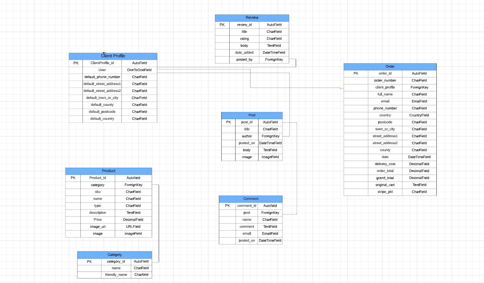  
- - -

## Marketing
Treats Sweet Shop is a e-commerce website that sells directly to consumers all over the world. It is a B2C focused webite, and the idea of the site is to be able to bring affordable sweets to people all over the world. We have tried to create an easy shopping experience for the users so that they are able to navigate and purchase products quickly and with ease. 

#### Social Media Marketing
As the budget is limited with this business we decided to use cheap organic marketing to start with and maybe in the future when business takes off we will look into some paid advertising. With all this in mind we decided to start with creating a Facebook Business page as Facebook is one of the biggest social media sites and one of the best for promoting a business. By creating a Facebook business page we then could post regular content of what we offer to keep the audience engaged. We have also decided on our Facebook page, to do monthly sweet hamper giveaways where the users just need to follow our page and share the post, this in turn is also a cheap way that we can advertise our business. The Facebook page can be found [here](https://www.facebook.com/profile.php?id=100094215246991). (please note Facebook may have removed this page as they tend to remove inactive pages so I have included a screenshot below)

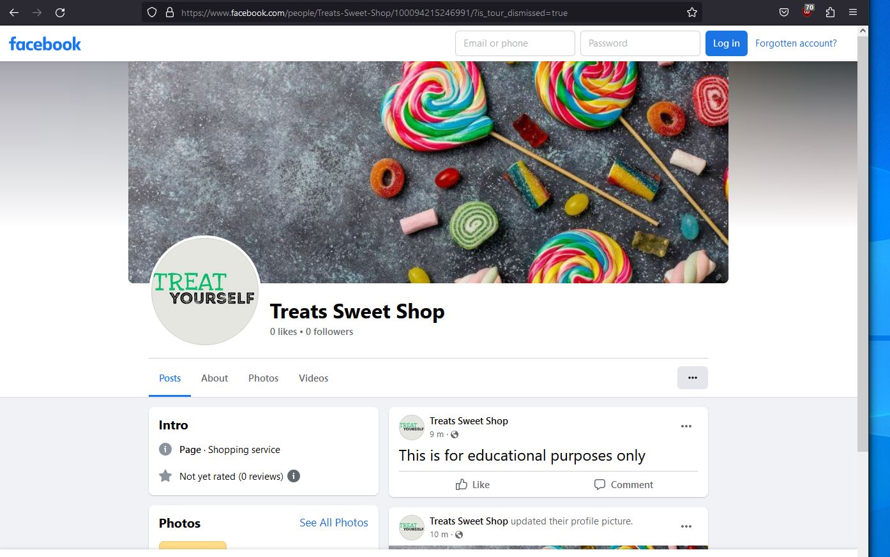  

#### Email Marketing
We also plan to send out a monthly news letter that details what products we have to offer and any new products that we may have on the site, as the site is still growing we will be constantly adding more and more products. In order to collect emails for our monthly mailing list we have added a suscribe inpupt field at the bottom of page in the footer where the user can enter their email address and then click suscribe, which will then sign them up to our monthly news letter. We used mailchimp to collect our mailing list.

#### Search Engine Optimization
For this project I completed research on which SEO keywords to use both short-tail(which are more broad generic and popular search terms ) and long-tail(which are keywords that are more specific, niche, and targeted terms that have a lower search volume and competition) in order to improve the search engine ranking so that our site will be more visible to people online.

#### Sitemap.xml
To help search engines crawl through our website a sitemap was created with a list of all the important urls and data on the site. We used XML sitemaps.com to create our sitemap.The website can be found [here](https://www.xml-sitemaps.com/)

#### Robots.txt
A robots.txt file was created to tell search engines where not to go on the site.

## Features

### Navigation Bar
- The Navigation bar sits at the very top of each page, The logo is at the left hand side and the navigation links are then to the left of the center of the page with the search, login/ register and shopping cart to the right hand side.
- When logged in the links for **Login** and the **Registeration** change to **My Profile** and **Logout**, if the user is a superuser then they will also have a **Add Product** link.
- The Navbar background is a light grey which is coloured using the the bootstrap **bg-info** class, the logo is green and the links are black in colour.
- The active page (page that the user is currently on) is displayed in bold text, this makes it stand out much more and is clear to the user which page they are on.
- When on medium to small screens the navigation menu changes to burger menu which shows all the nav links when clicked on.

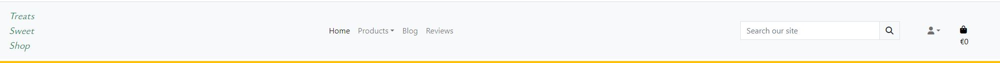  

### Footer
- The footer is found at the bottom of every page and responsive for tablet and mobile too.
- There are icon links to the business Instagram and Facebook page(please note these may have been removed by Facebook when you are reading this as they tend to remove inactive pages).
- Below the social media icons is a link to the sites private policy, which when clicked will bring the user to another page where they can read the Private Policy.
- Beneath this is an input box where the user can enter their email address, which will allow them to suscribe to the shops newsletter
- The background is also light grey like the Navigation bar.

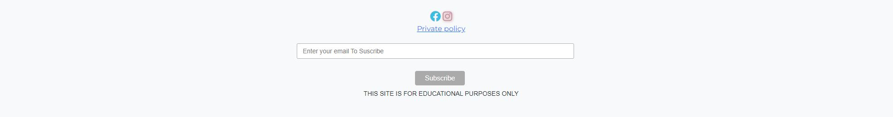
- - -

### Home Page
- The home page has 2 large images that both take up 50% of the screen width on large devices and 100% on small and medium screens.
- The image on the left is an image that I created using free trial of illustrator that says **Treat Yourself** and then underneather the text there is a button that says **Shop Now**, which once clicked will bring users to the all products page.
- The image on the right is a picture of different sweets on a table.

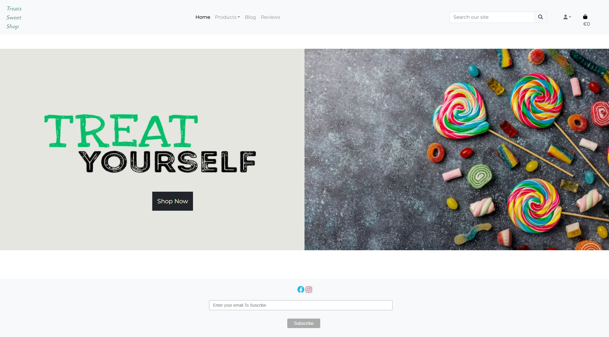 

[Back to the top](#treats-sweet-shop)
- - -  

### Products Page
- At the top of the Products page, right below the Nav bar there is a H1 heading that says **Products** which is underlined and centered.
- Below this are the Product cards which are displayed in the bootstrap card format, they are displayed 4 across on x-large screens, 3 across on large screens, 2 on small and medium and 1 accross on x-small screens which makes the page fully resonsive to all devices.
- On the right hand side above the products is a sort filter, where the user can sort by price, low to high or high to low and also can search alphabetically from A-Z or from Z-A.
- Each product displays a picture of the product, the name of it, the price and the category it is in, if the user clicks on the picture it will bring them to the product detail page where they can purchase a product.

 
- - -

### Product Details Page
- On the products detail page you will see the product image on the left and on mobile and small devices this will be the full width bar some padding.
- On the right of this you will have the product name, the price, a description, the category and if the user is an admin you will also see a delete and edit button. 
- Then you will see a quantity selector that can be increased or decrease by the **+** or **-** signs. Below the quantity selector there is a **Back** button that will bring you back to products when clicked and there is also an **Add to Cart** button that will add the product to your cart so you can purchase.

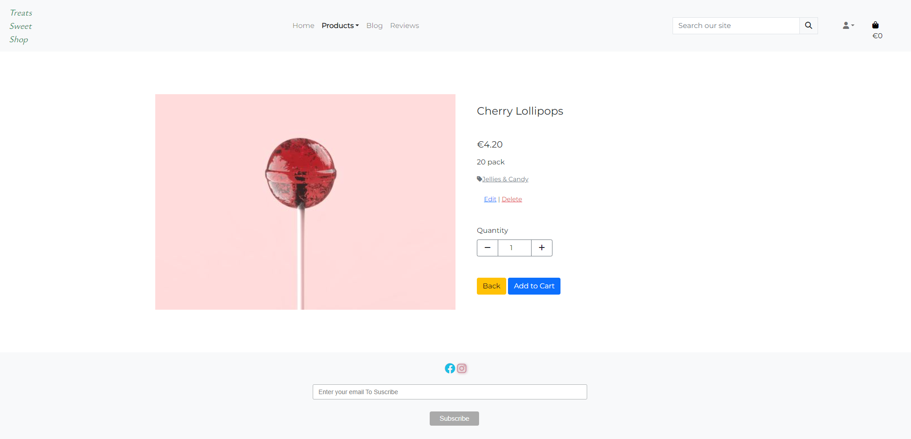 
- - -

### Shopping Cart Page
- When a user adds a product to their cart it is displayed in the shopping cart page, the user can add multiple products to their cart.
- At the top you will see a H2 heading saying **Shopping Cart** with a horizontial line above and below it.
- Then you will see 4 table headings which will say **Product Info**, **Price**, **Qty**, **Subtotal**.
- In the **Product Info** column you will see a small picture of the product and the product name, in the **Price** column you will see the price for each product. In the **Qty** you will see the quantity which you can change with the selector and click update, There is also a button to remove a product here. Then in the **Subtotal** column you will see the subtotal price for each item.
- Below the products that are in the shopping cart towards the right you will see the **Cart Total** and below this the **Delivery** which when added together will give you the **Grand Total**, beneath the grand total in red it will tell you how much more you need to spend to get free delivery if you havent already surpassed it.
- Then  we have a **Back** button which will bring the user back to the Products page and a **Secure Checkout** button which will bring the user to the secure checkout.

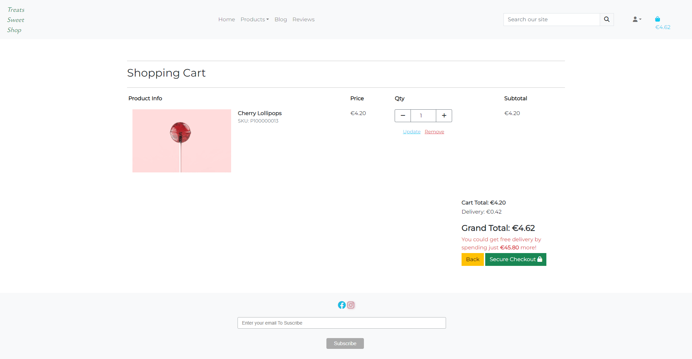 
- - -

### Checkout Page
- On the check out page at the top you will see a H2 heading that is centered and says **Checkout** with a horizontal line above and below it.
- Beneath this is the order summary which will show a **small picture of the items**, the **name of the product**, the **quantity**, **the price**, the **delivery** and the **grand total**.
- Then there is the form where the user will have to fill out the form with their **name**, **email**, **phone** and **address details**. There is also a check button that will save the info you have entered to your profile.
- Then there is the payment input where a user can enter their card details which will then be processed through **Stripe payments** when they click the **Complete Order** button below it.
- Beside the **Complete Order** button there is a **Back** button which will bring the user back to their cart, underneath the buttons in red writing you will see text saying how much your card will be charged.

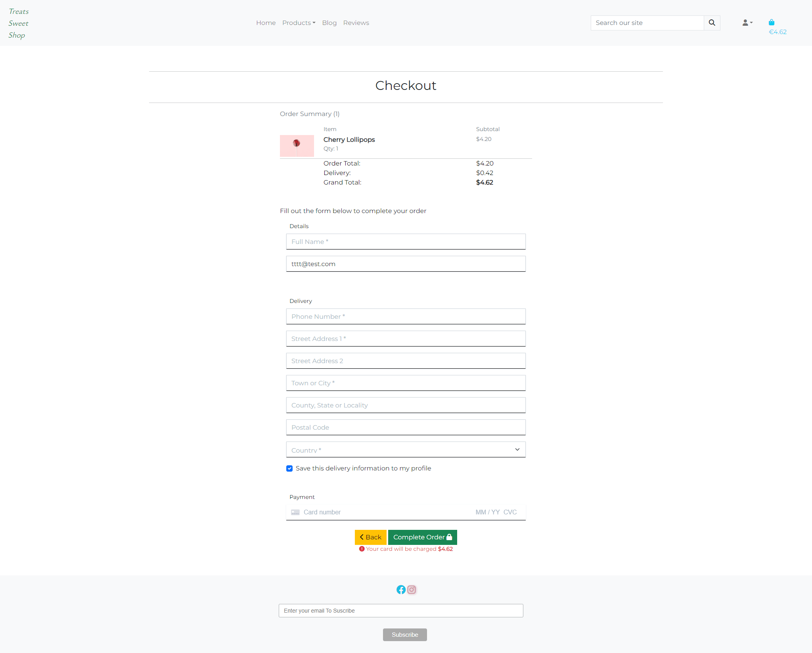 

[Back to the top](#treats-sweet-shop)
- - -

### Blog Page
- On the blog page you will see a link that says **Please log in to read the blogs** and when clicked will bring the user to the sign in page, where they can sign in or register, only users who are signed in can read each blog post(this link will not be visible if the user is signed in).
- Beneath this you will see the blog post in bootstrap card format which will show a picture, the title of the blog post, the date it was posted on and a blue **Read** button. If the user is not signed in when they click the read button it will bring them to the sign in page.
- If the user is an admin, then above the blog posts on the left side there will be a blue button that says **Add Post** which when clicked will bring the admin to a form where they can enter a new blog post.

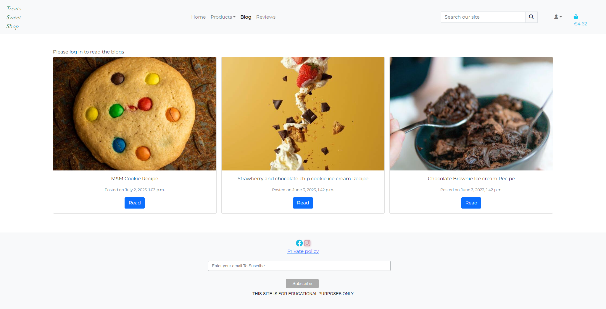 

### Post Detail page
- At the top of the Post details you will have the Post title displayed using a h2 heading tag, directly below this will be the image of the blog post and then below that will be the Post body which will display the main text of a post. Everything is centered bar on small and extra small devices where they take up nearly the full width of the screen.
- Below the Post body there is a comment section that will show any comments posted by users(users need to be signed in to view the blog post and to also comment)
- Under the comment section there is a **Post a Comment** box where a user can enter their comment and when they click post it will be displayed in the comment section. The user will also see a delete and edit button at the top right of their posted comments, if they click the delete button a bootstrap modal will appear asking them to confirm the deletion. If the user clicks the edit button they will be taken to another page that has a comment box with their posted comment in there for them to edit.
- If the user is an admin right below the image on the right side there will be an **edit** and **delete** button, if they click the **delete** button a bootstrap modal will appear asking them to confirm the deletion and if they click the **edit** button they will be taken to a prefilled form where they can edit the post.

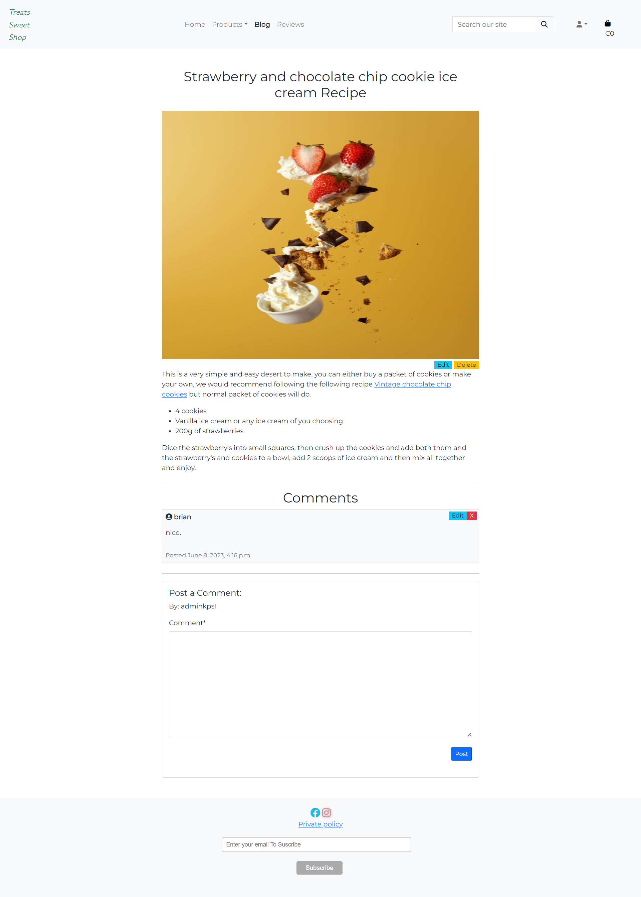 

**Delete Comment Modal**
 

**Edit Comment Page**
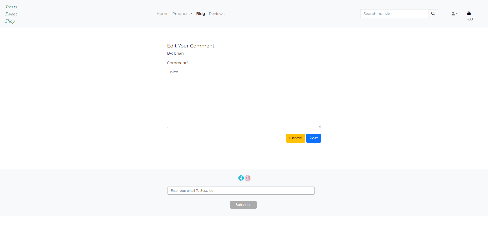 

**Delete Post Modal**
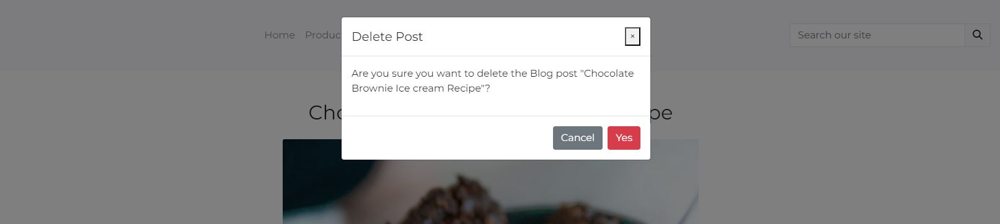 

**Edit Post Page**
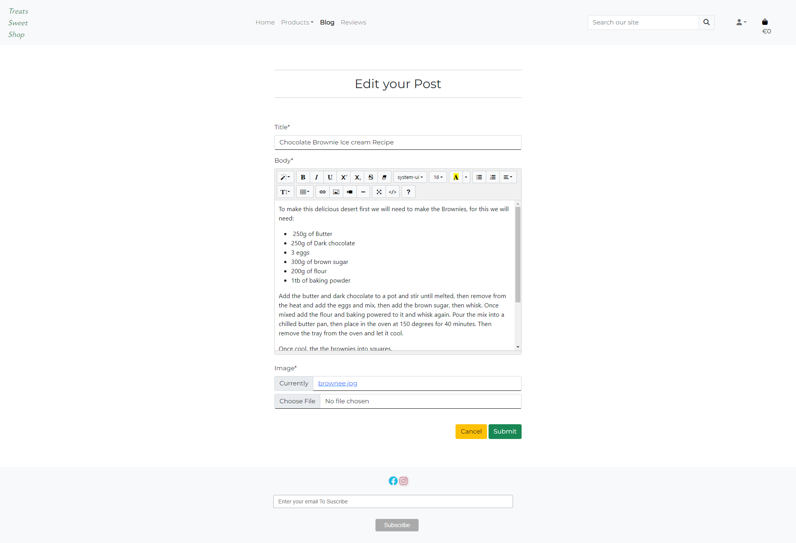 
- - -

### Reviews Page
- At the top of the review page in the center is H1 heading that says **Customer Reviews**.
- If the users is signed in then there is a green **Add A Review** button to the left just above the most recent review.
- Then below this are the reviews, which are each in a light grey coloured box, at the top left of the box is the review title then opposite this at the right hand side is the review stars which can be from 1 - 5.
- Below the title is the username of the person who posted the review and then underneath this is the body of the review, where the user can write a fully detailed review of the site.
- Then at the bottom left of the review you will see the date and time of when it was psoted on.
- At the bottom right there is a edit and delete button that is visible to the user who psoted the review, the **delete button** is orange and when clicked brings up a bootstrap modal asking the user if they want to confirm the deletion. Then beside this is blue **edit** button which allows the user to edit their review.

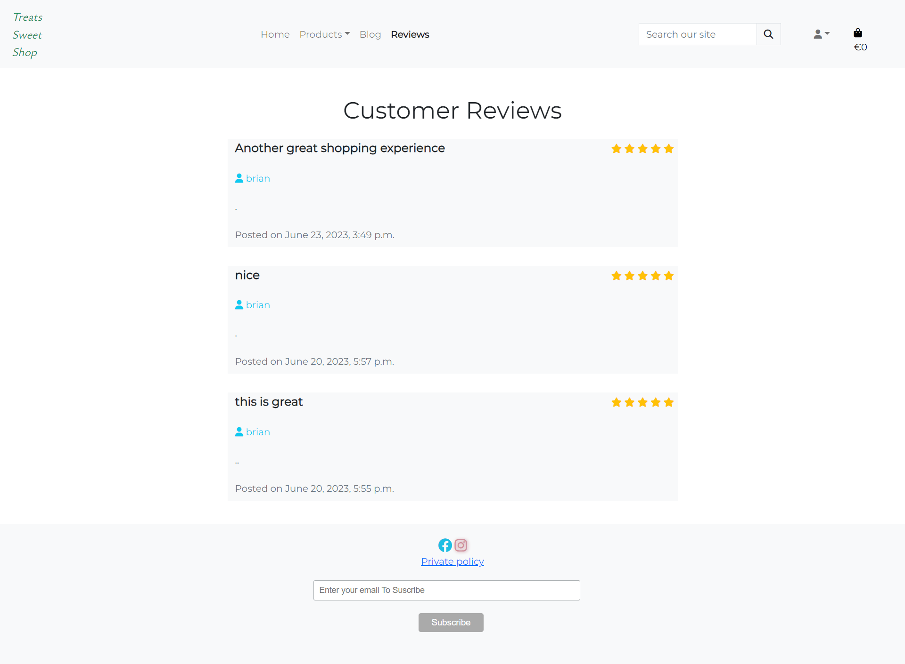 
- - -

### Add Review Page
- At the top of the page is a centered H2 heading that says **Write a Review** with a horizontal line above and below it.
- Then there is the form below it with the field of **Title**, **Body**, and the **Rating** which is a drop down with choices from 1 - 5.
- At the bottom right there is a yellow **Cancel** button that when clicked will bring the user back to the review page, beside this there is a green **Submit** button that once clicked will submit the form and bring the user back to the reviews page where they will see their freshly posted review.

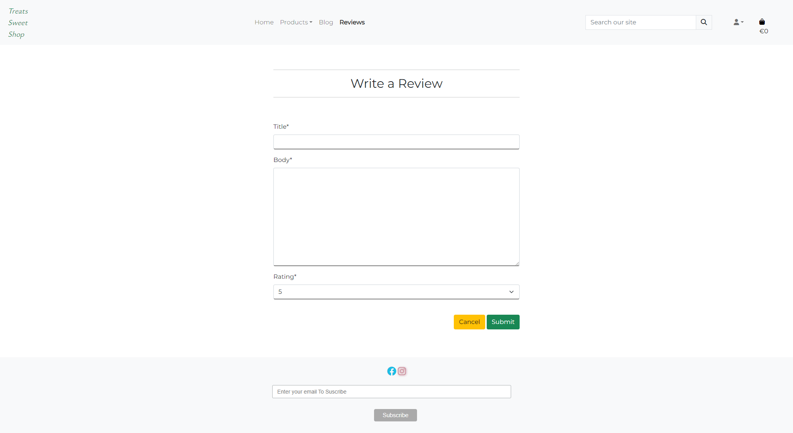 

[Back to the top](#treats-sweet-shop)
- - -

### Edit Review Page
- This is exactly like the **Add Review** page only the H2 heading at the top says **Edit Your Review** and has the form already prepoulated with the users previous review so that they can edit it.

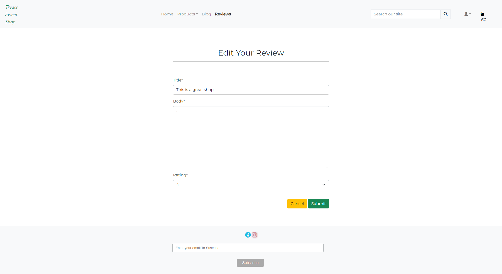 
- - -

### Add Product Page
- This page is only available to admins so that they can add a product to the site, on the top of the page is a H2 heading that is centered and says **Add a Product** with a horizontal line above and below it.
- Below this we have the form with the first input **category** being a drop down, there is the other inputs **Sku**, **Name**, **Type**, **Description**, **Price**, **Image Url** and **Image**.
- Then below the form on the right is a yellow **Cancel** button that when clicked will bring the admin back to the products page, beside it is a green **Add Product** button that will add the product to the porducts page once clicked and as logn as the form is filled out.

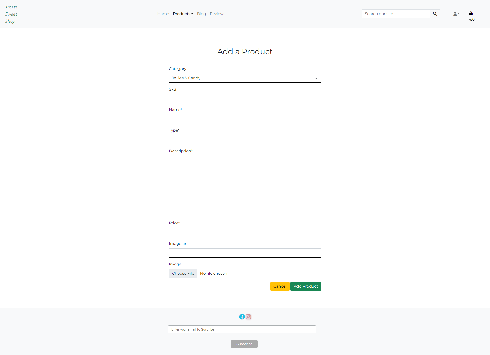 
- - -

## Future Features
- In the future I would like to add more products to the site and maybe also add some soft drinks so that users could order sweeets and drinks.
- I would also like a implememnt a stock monitoring system for the site admins so they would know how much of each product that they have and also when they would need to order more of a certain product, although at the momemnt I'm not so sure as to which would be the best way to tackle this.

## Technologies Used
- [Balsamiq](https://en.wikipedia.org/wiki/Balsamiq) was used to create the wireframes.
- [LucidChart](https://www.lucidchart.com/pages/) was used to design the database schema.
- [HTML](https://en.wikipedia.org/wiki/HTML) was used for the mark up.
- [CSS](https://en.wikipedia.org/wiki/CSS)  was used to style the site.
- [Django](https://www.djangoproject.com/) was the framework that was used.
- [Python](https://en.wikipedia.org/wiki/Python_(programming_language)), django is a python framework.
- [Bootstrap](https://en.wikipedia.org/wiki/Bootstrap_(front-end_framework)) was also used to style the site.
- [JavaScript](https://en.wikipedia.org/wiki/JavaScript) was used for interactiveness.
- [Gitpod](https://www.gitpod.io/about) was used to create this site and then push everything to github.
- [Heroku](https://en.wikipedia.org/wiki/Heroku) is used to host this site.
- [Github](https://en.wikipedia.org/wiki/GitHub) was used to store the code.
- [Git](https://en.wikipedia.org/wiki/Git) was used for version control.
- [AWS](https://aws.amazon.com/) was used to store the images and static files.
- [ElephantSQL](https://www.elephantsql.com/) was used to store the database.
- - -

## Testing
The testing section can be found [here](TESTING.md).

## Deployment
This website is deployed to Heroku from a github repository, the following steps were taken:

#### Creating Respository on Github
- First make sure you are signed into [Github](https://github.com/) and go to code institutes template, which can be found [here](https://github.com/Code-Institute-Org/gitpod-full-template).
- Then click on **use this template** and select **Create a new repository** from the drop down. Enter the name for the repository and click **Create repository from template**.
- Once the repository was created, I clicked the green **gitpod** button to create a workspace in gitpod so that I could write the code for the site.

#### Creating app on Heroku
- After creating the repository on github, head over to [heroku](https://www.heroku.com/) and sign in.
- On the home page, click **New** and **Create new app** from the drop down.
- Give the app a name(this must be unique) and select a **region** I chose **Europe** as I am in Europe, Then click **Create app**.

#### Create a database On ElephantSQL
- Log into the [ElephantSQL](https://www.elephantsql.com/) website and click **Create new Instance**
- Enter a **Name** and keep the plan as **Tiny Turtle Free**, the **tags** field can be left blank, Select a region closest to you, I selected **EU-West-1(Ireland)** as I'm in Ireland. Then click **Review** and afterwards click **create instance**.
- On The Dashboard click on your database instance name.
- You will see the details for your database instance, in the url section click on the copy icon to copy the database url.
- Head over to gitpod and create a **Database URL** enviroment variable in your env.py file and set it equal to the copied url.

#### Deploying to Heroku.
- Head back over to [heroku](https://www.heroku.com/) and click on your **app** and then go to the **Settings tab**
- On the **settings page** scroll down to the **config vars** and enter your key and value pairs.
- Then scroll to the top and go to the **deploy tab** and go down to the **Deployment method** section and select **Github** and then sign into your account.
- Below that in the **search for a repository to connect to** search box enter the name of your repository that you created on **github** and click **connect**
- Once it has connected scroll down to the **Manual Deploy** and click **Deploy branch** when it has deployed you will see a **view app** button below and this will bring you to your newly deployed app.
- Please note that when deploying manually you will have to deploy after each change you make to your repository.
- - -

## Credits
- Django For Beginners book, This is a book that I would recommend to everyone who wants to learn Django, this made me understand how to create simple class based views. The first 4 chapters can be read [here](https://djangoforbeginners.com/introduction/).
- Code Institutes **Boutique Ado** walk through project was a great help, as it really gave me a way to structure a project and then build off it, I would have been totally lost without this.
- Emmanuel Okiches youtube video for how to add an **active** class using djangos template lanuage. The video can be found [here](https://www.youtube.com/watch?v=e_D_hoJ1kAc).
- [Bootstrap Documentation](https://getbootstrap.com/docs/5.3/layout/containers/) was great for looking up syntax and how to do something with bootstrap.
- [Stack Overflow](https://stackoverflow.com/) is probably a developers best resource, this provided me with many answers to my questions.
- [W3schools](https://www.w3schools.com/) this was great for looking up forgotten **CSS** and syntax and how to use it.
- [Unsplash](https://unsplash.com/) all images were take from unsplash.
- [30secondsofcode](https://www.30secondsofcode.org/articles/s/css-footer-at-the-bottom) showed me how to keep the footer at the bottom of the page.
- [Sonar Systems](https://www.youtube.com/watch?v=AZs4zggS7kA) youtube video helped me with getting the bootstrap toasts to work the way I wanted.

## Acknowledgements
- I would like to thank my mentor Adegbenga Adeye for all help throughout the project and for being really positive about the course.
- I would like to thank Code Institutes Slack Communtiy as this helped me so much when I got stuck on part of my project and also with course challenges.
- I would to thank tutor support for all the help when I got stuck and  could not figure an issue out, they provided great support.
- I would also like to thank our chort facilitators Iris Smok and Kasia Bogucka, for answering any course related questions I asked and for porviding us with a weekly study schedule.

[Back to the top](#treats-sweet-shop)