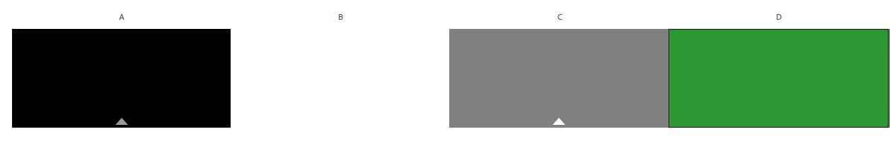

# Treats Sweet Shop
Treat Sweet Shop is a e-Commerce website that I build Using the Django Full Stack Frameworl for my fifth and final project at Code Institute.
Treats Sweet shop is a online sweet store where users can purchase sweets from a wide variety, there is alos a secion on the website that allows users to leave review of their experience shoppping at Treats. I have also include a blog section where that admin can post blog and then registered users are able to comment underneath said blogs.
  
  

[Click Here To Visit Live Site](https://treats-sweet-shop.herokuapp.com/)  

## Table Of Contents:
1. [UX Design](#ux-design)
    * [User Stories](#user-stories)
    * [Wireframes](#wireframes)
    * [Agile Methodology](#agile-methodology)
    * [Typography](#typography)
    * [Colour Scheme](#colour-scheme)
    * [Database Diagram](#database-diagram)

3. [Marketing](#marketing)

2. [Features](#features)
    * [Navigation](#Navigation-bar)
    * [footer](#footer)
    * [Home Page](#home-page)
    * [Recipes Page](#recipes-page)
    * [Recipe Details](#recipe-details)
    * [Add Recipe Page](#add-recipe-page)
    * [Edit Recipe Page](#edit-recipe-page)
    * [Delete Recipe Page](#delete-recipe)
    * [Edit Comment Page](#edit-comment-page)
    * [Wines](#wines-page)
    * [Wine Detail Page](#wine-details-page)
    * [Add Wine Page](#add-wine-page)
    * [Edit Wine Page](#edit-wine-page)
    * [Delete Wine](#delete-wine)
    * [Register Page](#register-page)
    * [Login Page](#login-page)
    * [Logout Page](#logout-page)

3. [Future Features](#future-features)
4. [Technologies Used](#technologies-used)
5. [Testing](#testing)
6. [Deployment](#deployment)
7. [Credits](#credits)
8. [Acknowledgements](#acknowledgements)

### User Stories
Below are the user stories that were added to the Github project, They can be found [here](https://github.com/kpsdev1/Treats-Sweet-Shop/issues) in the issue section of the repository.

**EPIC | Navigation**
- As a User I can easily navigate around the site so that I can view different pages and sections on the site.

**EPIC - Registration & Login / Logout**
- As a User I can Sign-in/ Sign-out so that I can access features when signed in and sign-out so that no one can access my account.
- As a User I can Register an account so that I can use the full functionality of the site.
- As a User I can register with my social media account so that I can sign up faster.

**EPIC - CRUD Functionality**
- As a User I can view a list of products so that click on one to see the product details.
- As a Superuser I can add a new product so that I can sell them on the site.
- As a Superuser I can edit a product so that I can make changes to a product.
- As a Superuser I can delete a product from the site.
- As a User I can add a product to my shopping cart so that I can purchase it.
- As a User I can Update my shopping cart so that I can change what's in my cart before checking out.
- As a User I can remove a product from my cart so that can remove it an purchase the other items in my cart.
- As a User I can Leave a review so that share my experience of shopping here.
- As a User I can edit my review so that I can I can change it.
- As a User I can Delete my review so that I can remove it.

### Wireframes
Below are the wireframes for the site that I created using balsamiq.

### Agile Methodology
Github projects was used to track the development of this website using the agile approach, the project can be found [here](https://github.com/users/kpsdev1/projects/6).

### Typography
- The font that was used for the logo was **Ysabeau**.
- **Montserrat** font was used for the body.

### Colour Scheme
For this site I decide to keep the main color scheme very simple, with the text being black or grey. The logo and the login/ logout page headings in green. I did also have some buttons like the delete, cancel, edit and post buttons red, orange and blue but the main color scheme of the site was black, white, grey.
  
  

### DataBase Diagram
Below is the database diagram that I created using LucidCharts.

  