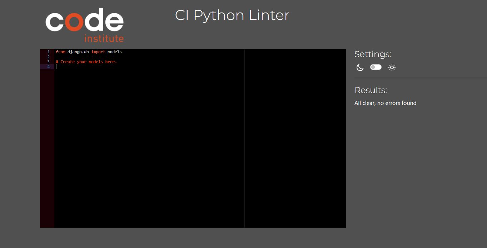

## Table Of Contents:
1. [Validator Testing](#vadilidator-testing)
    * [Html](#html)
    * [CSS](#css)
    * [JavaScript](#javascript)
    * [Python](#python)
    * [Lighthouse](#lighthouse)
    * [GTmetrix](#gtmetrix)
    
2. [Browser and Deivce Testing](#browser-and-device-testing)
3. [User Story Testing](#user-story-testing)
4. [Manual Testing](#manual-testing)
5. [Bugs](#bugs)

## Validator Testing

### Python
- I tested the project using the PEP8 validator in gitpod, this I had installed from my previous project, but it can be installed by running **pip3 install pycodestyle** then searching for **Python**, Select **Linter** and then select **pycodestyle**. The PEP8 errors would then be underlined in red and also listed in the **Problems tab**. This returned no errors.
- I also tested the site on **Code Institutes pep8 online** website. Which can be found [here](https://pep8ci.herokuapp.com/). As you can see from the below screenshots, no errors were found.

##### Home App

    
admin.py
  
    
  

    
models.py
  
    
  

    
urls.py
  
    
  

    
views.py
  
    
  

  

##### Review App

    
admin.py
  
    
  

    
form.py
  
    
  

    
models.py
  
    
  

    
urls.py
  
    
  

    
views.py
  
    
  

  
##### Profiles App

    
admin.py
  
    
  

    
form.py
  
    
  

    
models.py
  
    
  

    
urls.py
  
    
  

    
views.py
  
    
  

##### Products App

    
admin.py
  
    
  

    
form.py
  
    
  

    
models.py
  
    
  

    
urls.py
  
    
  

    
views.py
  
    
  

  

##### Checkout App

    
admin.py
  
    
  

    
form.py
  
    
  

    
models.py
  
    
  

    
signals.py
  
    
  

    
urls.py
  
    
  

    
views.py
  
    
  

    
webhook.py
  
    
  

    
webhook_handler.py
  
    
  

  

##### Cart App

    
admin.py
  
    
  

    
contexts.py
  
    
  

    
models.py
  
    
  

    
urls.py
  
    
  

    
views.py
  
    
  

  

##### Blog App

    
admin.py
  
    
  

    
form.py
  
    
  

    
models.py
  
    
  

    
urls.py
  
    
  

    
views.py
  
    
  

*Just to note, the settings.py file gave some **line too long** errors which are related to the default authorization, which I was told can be ignored in this file so I added the **Noqa** comment to them so that the linter would not read them, I also added the comment on a few lines through the project that did not make sense to breakup*
